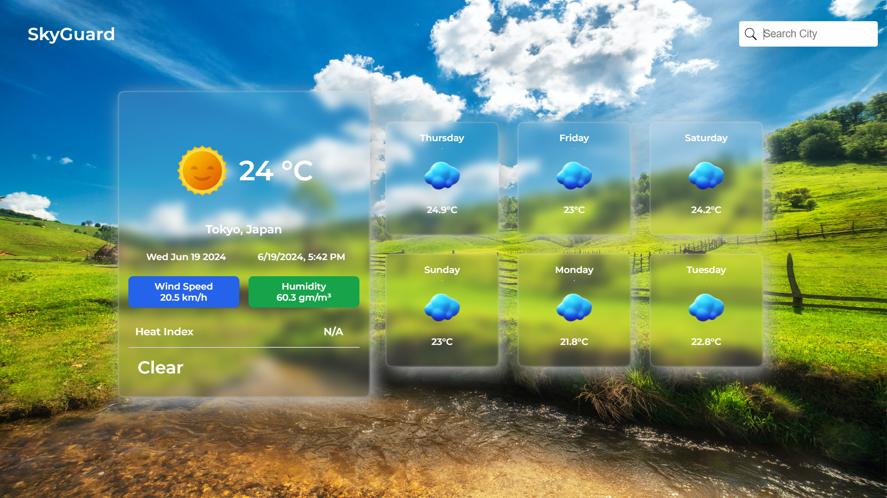
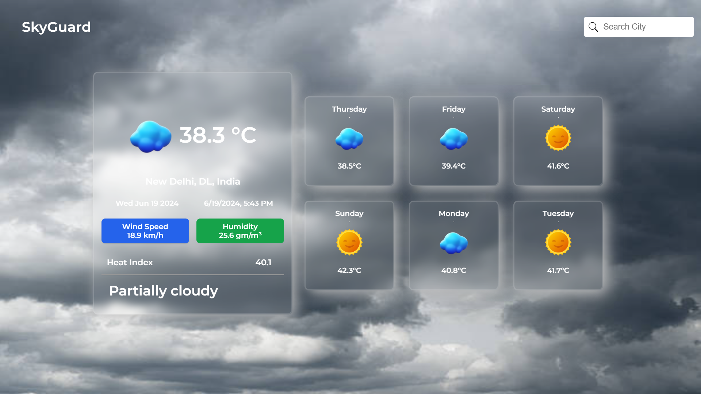

# Weather App

A simple weather application built using React.js and the Visual Crossing Weather API from RapidAPI. This app allows users to get current weather information for any city.

## Features

- Fetch current weather data for any city
- Display temperature, weather conditions, humidity, and wind speed
- User-friendly interface with input for city names
- Error handling for invalid city names or API errors

## Screenshots




## Installation

1. Clone the repository:

```bash
git clone https://github.com/rishabhdas1006/sky-guard-weather-app.git
```
2. Install the dependencies:

```bash
npm install
```
3. Create a .env file in the root directory and add your RapidAPI key:

```bash
REACT_APP_RAPIDAPI_KEY = your-rapidapi-key
```
4. Start the development server:

```bash
npm start
```

5. Open your browser and navigate to http://localhost:3000.

## Available Scripts

In the project directory, you can run:

### `npm start`

Runs the app in the development mode.\
Open [http://localhost:3000](http://localhost:3000) to view it in your browser.

The page will reload when you make changes.\
You may also see any lint errors in the console.

### `npm test`

Launches the test runner in the interactive watch mode.

### `npm run build`

Builds the app for production to the `build` folder.

The build is minified and the filenames include the hashes.\
Your app is ready to be deployed!

### `npm run eject`

**Note: this is a one-way operation. Once you `eject`, you can't go back!**

If you aren't satisfied with the build tool and configuration choices, you can `eject` at any time. This command will remove the single build dependency from your project.

Instead, it will copy all the configuration files and the transitive dependencies (webpack, Babel, ESLint, etc) right into your project so you have full control over them. All of the commands except `eject` will still work, but they will point to the copied scripts so you can tweak them. At this point you're on your own.

You don't have to ever use `eject`. The curated feature set is suitable for small and middle deployments, and you shouldn't feel obligated to use this feature. However we understand that this tool wouldn't be useful if you couldn't customize it when you are ready for it.

##Usage

1. Enter the name of the city you want to get weather information for.

2. Click the "Search city" button.

3. The app will display the current weather information for the specified city.

## API Reference

This app uses the Visual Crossing Weather API from RapidAPI. To use this API, you need an API key from RapidAPI. You can sign up and get your API key from RapidAPI.

### Example API Request

```bash
const options = {
  method: 'GET',
  url: 'https://visual-crossing-weather.p.rapidapi.com/forecast',
  params: {location: 'city-name', aggregateHours: '24', contentType: 'json', unitGroup: 'metric'},
  headers: {
    'X-RapidAPI-Key': process.env.REACT_APP_RAPIDAPI_KEY,
    'X-RapidAPI-Host': 'visual-crossing-weather.p.rapidapi.com'
  }
};

axios.request(options).then(response => {
  console.log(response.data);
}).catch(error => {
  console.error(error);
});

```

## Contributing
Contributions are welcome! Please feel free to submit a Pull Request.